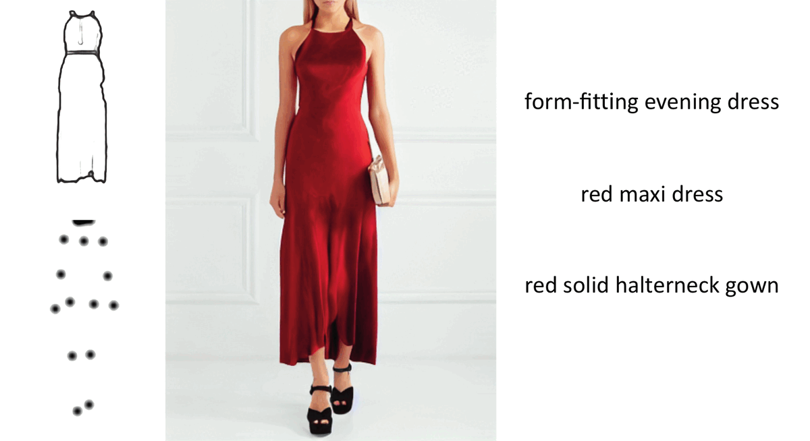

# Multimodal Garment Designer (ICCV 2023)
### Human-Centric Latent Diffusion Models for Fashion Image Editing
[**Alberto Baldrati**](https://scholar.google.com/citations?hl=en&user=I1jaZecAAAAJ)**\***,
[**Davide Morelli**](https://scholar.google.com/citations?user=UJ4D3rYAAAAJ&hl=en)**\***,
[**Giuseppe Cartella**](https://scholar.google.com/citations?hl=en&user=0sJ4VCcAAAAJ),
[**Marcella Cornia**](https://scholar.google.com/citations?hl=en&user=DzgmSJEAAAAJ),
[**Marco Bertini**](https://scholar.google.com/citations?user=SBm9ZpYAAAAJ&hl=en),
[**Rita Cucchiara**](https://scholar.google.com/citations?hl=en&user=OM3sZEoAAAAJ)

**\*** Equal contribution.

[](https://arxiv.org/abs/2304.02051)
[](https://github.com/aimagelab/multimodal-garment-designer)

This is the **official repository** for the [**paper**](https://arxiv.org/abs/2304.02051) "*Multimodal Garment Designer: Human-Centric Latent Diffusion Models for Fashion Image Editing*".

## Overview

<p align="center">
    
</p>

>**Abstract**: <br>
> Fashion illustration is used by designers to communicate their vision and to bring the design idea from conceptualization to realization, showing how clothes interact with the human body. In this context, computer vision can thus be used to improve the fashion design process. Differently from previous works that mainly focused on the virtual try-on of garments, we propose the task of multimodal-conditioned fashion image editing, guiding the generation of human-centric fashion images by following multimodal prompts, such as text, human body poses, and garment sketches. We tackle this problem by proposing a new architecture based on latent diffusion models, an approach that has not been used before in the fashion domain. Given the lack of existing datasets suitable for the task, we also extend two existing fashion datasets, namely Dress Code and VITON-HD, with multimodal annotations collected in a semi-automatic manner. Experimental results on these new datasets demonstrate the effectiveness of our proposal, both in terms of realism and coherence with the given multimodal inputs.

## Citation
If you make use of our work, please cite our paper:

```bibtex
@inproceedings{baldrati2023multimodal,
  title={Multimodal Garment Designer: Human-Centric Latent Diffusion Models for Fashion Image Editing},
  author={Baldrati, Alberto and Morelli, Davide and Cartella, Giuseppe and Cornia, Marcella and Bertini, Marco and Cucchiara, Rita},
  booktitle={Proceedings of the IEEE/CVF International Conference on Computer Vision},
  year={2023}
}
```

## Getting Started

We recommend using the [**Anaconda**](https://www.anaconda.com/) package manager to avoid dependency/reproducibility
problems.
For Linux systems, you can find a conda installation
guide [here](https://docs.conda.io/projects/conda/en/latest/user-guide/install/linux.html).

### Installation

1. Clone the repository

```sh
git clone https://github.com/aimagelab/multimodal-garment-designer
```

2. Install Python dependencies

```sh
conda env create -n mgd -f environment.yml
conda activate mgd
```

Alternatively, you can create a new conda environment and install the required packages manually:

```sh
conda create -n mgd -y python=3.9
conda activate mgd
pip install torch==1.12.1 torchmetrics==0.11.0 opencv-python==4.7.0.68 diffusers==0.12.0 transformers==4.25.1 accelerate==0.15.0 clean-fid==0.1.35 torchmetrics[image]==0.11.0
```

## Inference

To run the inference please use the following:

```
python src/eval.py --dataset_path <path> --batch_size <int> --mixed_precision fp16 --output_dir <path> --save_name <string> --num_workers_test <int> --sketch_cond_rate 0.2 --dataset <dresscode|vitonhd> --start_cond_rate 0.0 --test_order <paired|unpaired>
```

- ```dataset_path``` is the path to the dataset (change accordingly to the dataset parameter)
- ```dataset``` dataset name to be used
- ```output_dir``` path to the output directory
- ```save_name``` name of the output dir subfolder where the generated images are saved
- ```start_cond_rate``` rate {0.0,1.0} of denoising steps that will be used as offset to start sketch conditioning
- ```sketch_cond_rate``` rate {0.0,1.0} of denoising steps in which sketch cond is applied
- ```test_order``` test setting (paired | unpaired)

Note that we provide a few sample images to test MGD simply by cloning this repo (*i.e.*, assets/data). To execute the code set 
- Dress Code Multimodal dataset
    - ```dataset_path``` to ```../assets/data/dresscode```
    - ```dataset``` to ```dresscode```
- Viton-HD Multimodal dataset
    - ```dataset_path``` to ```../assets/data/vitonhd```
    - ```dataset``` to ```vitonhd```

It is possible to run the inference on the whole Dress Code Multimodal or Viton-HD Multimodal dataset simply changing the ```dataset_path``` and ```dataset``` according with the downloaded and prepared datasets (see sections below).


## Pre-trained models
The model and checkpoints are available via torch.hub.

Load the MGD denoising UNet model using the following code:

```
import torch
unet = torch.hub.load(
    dataset=<dataset>, 
    repo_or_dir='aimagelab/multimodal-garment-designer', 
    source='github', 
    model='mgd', 
    pretrained=True
    )
```

- ```dataset``` dataset name (dresscode | vitonhd)

Use the denoising network with our custom diffusers pipeline as follow:

```
from src.mgd_pipelines.mgd_pipe import MGDPipe
from diffusers import AutoencoderKL, DDIMScheduler
from transformers import CLIPTextModel, CLIPTokenizer

pretrained_model_name_or_path = "runwayml/stable-diffusion-inpainting"

text_encoder = CLIPTextModel.from_pretrained(
    pretrained_model_name_or_path, 
    subfolder="text_encoder"
    )

vae = AutoencoderKL.from_pretrained(
    pretrained_model_name_or_path, 
    subfolder="vae"
    )

tokenizer = CLIPTokenizer.from_pretrained(
    pretrained_model_name_or_path,
    subfolder="tokenizer",
    )

val_scheduler = DDIMScheduler.from_pretrained(
    pretrained_model_name_or_path,
    subfolder="scheduler"
    )
val_scheduler.set_timesteps(50)

mgd_pipe = MGDPipe(
    text_encoder=text_encoder,
    vae=vae,
    unet=unet,
    tokenizer=tokenizer,
    scheduler=val_scheduler,
    )
```

For an extensive usage case see the file ```eval.py``` in the main repo.

## Datasets
We do not hold rights on the original Dress Code and Viton-HD datasets. Please refer to the original papers for more information.

Start by downloading the original datasets from the following links:
- Viton-HD **[[link](https://github.com/shadow2496/VITON-HD)]**
- Dress Code **[[link](https://github.com/aimagelab/dress-code)]**


Download the Dress Code Multimodal and Viton-HD Multimodal additional data annotations from here.

- Dress Code Multimodal **[[link](https://drive.google.com/file/d/1dwnAi1CNmmF_YdbIDfm8078dGh4ci47L/view?usp=sharing)]**
- Viton-HD Multimodal **[[link](https://drive.google.com/file/d/1Z2b9YkyBPA_9ZDC54Y5muW9Q8yfAqWSH/view?usp=sharing)]**

### Dress Code Multimodal Data Preparation
Once data is downloaded prepare the dataset folder as follows:

<pre>
Dress Code
| <b>fine_captions.json</b>
| <b>coarse_captions.json</b>
| test_pairs_paired.txt
| test_pairs_unpaired.txt
| train_pairs.txt
| <b>test_stitch_map</b>
|---- [category]
|-------- images
|-------- keypoints
|-------- skeletons
|-------- dense
|-------- <b>im_sketch</b>
|-------- <b>im_sketch_unpaired</b>
...
</pre>

### Viton-HD Multimodal Data Preparation
Once data is downloaded prepare the dataset folder as follows:

<pre>
Viton-HD
| <b>captions.json</b>
|---- train
|-------- image
|-------- cloth
|-------- image-parse-v3
|-------- openpose_json
|-------- <b>im_sketch</b>
|-------- <b>im_sketch_unpaired</b>
...
|---- test
...
|-------- <b>im_sketch</b>
|-------- <b>im_sketch_unpaired</b>
...
</pre>


## TODO
- [ ] training code

## Acknowledgements
This work has partially been supported by the PNRR project “Future Artificial Intelligence Research (FAIR)”, by the PRIN project “CREATIVE: CRoss-modal understanding and gEnerATIon of Visual and tExtual content” (CUP B87G22000460001), both co-funded by the Italian Ministry of University and Research, and by the European Commission under European Horizon 2020 Programme, grant number 101004545 - ReInHerit.

## LICENSE
<a rel="license" href="http://creativecommons.org/licenses/by-nc/4.0/"></a><br />All material is available under [Creative Commons BY-NC 4.0](https://creativecommons.org/licenses/by-nc/4.0/). You can **use, redistribute, and adapt** the material for **non-commercial purposes**, as long as you give appropriate credit by **citing our paper** and **indicate any changes** you've made.
